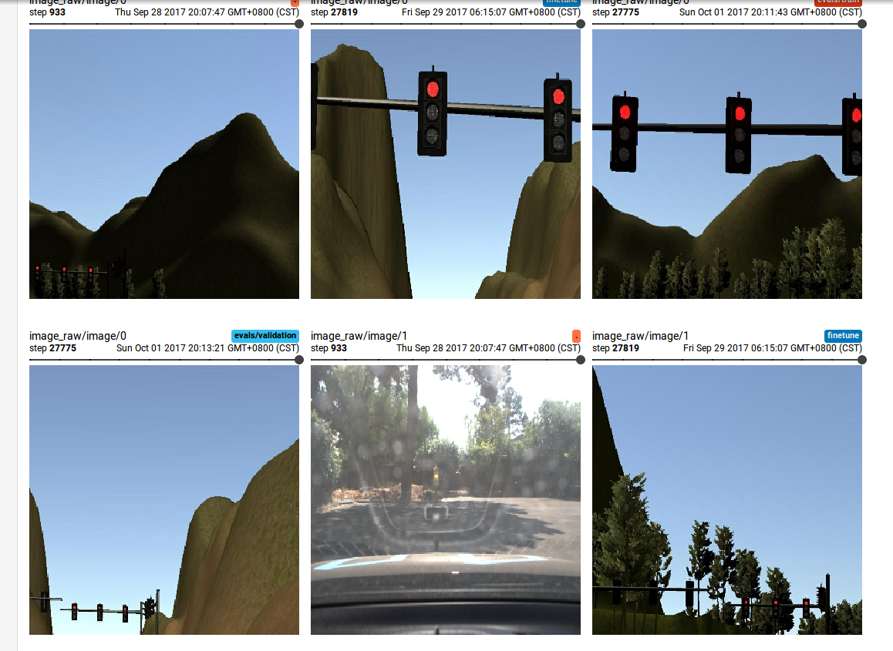
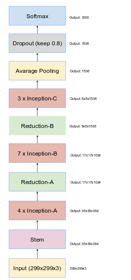
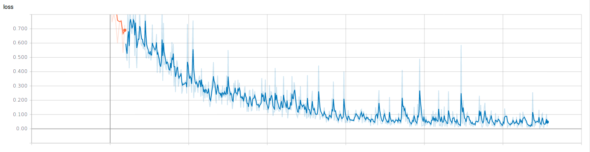
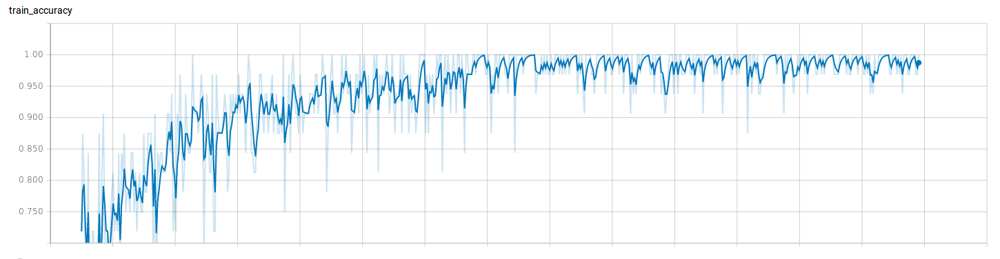
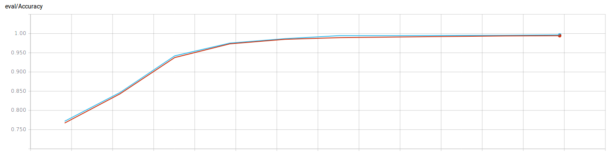

# Programming a Real Self-Driving Car
Self-Driving Car Engineer Nanodegree Program, Capstone Project

## Project Overview

The goal of this project is to design a miniature self driving car system that enable Udacity car Carla  to drive around the test track using waypoint navigation. Traffic lights are placed in the test track, Carla needs to stop and start properly depending on the traffic light in front of it. Our system consists of three major components. Perception component detects and classify the traffic light ahead of the car via images captured from the car camera. Planning component set target velocity for the waypoints ahead of vehicle depending on desired vehicle behavior.  Control component  actuates the throttle, brake,and steering to successfully navigate the waypoints with correct target velocity. A car/test track simulator is also provided to facilitate the development so that we can test our codes before submitting them to be tested on Carla.

## Team members

Team Member | Udacity Account Eamil|Location
----------- | ---------------------|----------- |
Jiandong Jin | jjdblast@gmail.com| China
Roi Yozevitch	| yozevitch@gmail.com | Turkey
Yong Kiat Tay	| yongkiattay@gmail.com | Singapore
Levin Jian	| jianzhirong@gmail.com | China
Keisuke Seya	| keisuke.seya@gmail.com | Japan

## Sub Tasks

* Jiandong Jin:
  - set up team resources (mainly slack channel)
  - documentation
  
* Roi Yozevitch: 
  - train a classifer out of hybrid images
  
* Yong Kiat Tay: 
  - collect and label simulator images
  - optimize waypoint distance calculation
  
* Levin Jian: 
  - stable driving to complete the whole lap
  - collect and label simulator images
  - train a classifier out of simulator images
  - train a classifer out of hybrid images
  
* Keisuke Seya: 
  - stable driving to complete the whole lap
  - stop the car based on /vehicle/traffic_lights topic
  - collect and label simulator images
  
## Schedule

| Task                                                                             | Comments                                                                                                                                                           | target date | current participants      | Status |   |   |
|----------------------------------------------------------------------------------|--------------------------------------------------------------------------------------------------------------------------------------------------------------------|-------------|---------------------------|--------|---|---|
| stable driving to complete the whole lap                                         | most urgent task so far, for now we suspect current unstable behavior is caused by excessive resource consumtion, note the root cause could also be something else | Sep 22      | Levin, Keisuke            | Close  |   |   |
| Stop the car based on /vehicle/traffic_lights topic                              |                                                                                                                                                                    |             | Keisuke                   | Open   |   |   |
| collect and label simulator images                                               | the target of this item is to collect and label a few thoudands of traffic light images                                                                            | Sep 23      | Yong Kiat, Levin, Keisuke | Close  |   |   |
| train a classifier out of simulator images                                       | pending on 3                                                                                                                                                       | Sep 28      | Levin                     | Close  |   |   |
| train a classifer out of hybrid images                                           | pending on 4                                                                                                                                                       |             | Levin, Yozevitch          | Close  |   |   |
| Replace /vehicle/traffic_lights topic by actual detection result from classifier | pending on all above                                                                                                                                               | Oct 1       |                           | Open   |   |   |
| classifier model, training/validaton scripts                                     | This part has been verified on site traffic light images, and should be okay                                                                                       | N/A         |                           | Close  |   |   |

## Project Components

### 1. Nodes

#### 1.1 Perception

In our project, the position of traffic lights in test track are already provided. Perception model starts collecting camera images when it's within certain distance from the traffic light and classify the image as one of the three status: RED, YELLOW, and GREEN. Carla is required to run at 10mph at maximum, and its speed is relatively slow, so we we start collecting camera images when the traffic light is 40 meters away.  

Inception V4 model are selected as our classifier model, and we use one single model to classify traffic light images from both simulator and site.  

##### 1.1.1 Dataset
As the classifier is expected to work in both simulator and site, images from both sources are collected.  

A scripts is developed to automatically collect and images from simulator. 

|                                    | 0-red | 1-yellow | 2-green | Sum  |
|:-----------------------------------|:-----:|:--------:|:-------:|:----:|
| train              | 8094   | 920      | 1673     | 10687 |
| eval | 1618   | 184      | 334     | 2136 |
| test  | 2527    | 205       | 440      |  3172  |

traffic light images from site are provided by uacity

|                                    | 0-red | 1-yellow | 2-green | Sum  |
|:-----------------------------------|:-----:|:--------:|:-------:|:----:|
| train              | 265   | 107      | 280     | 652 |
| eval | 66   |   26   | 93     | 185 |
| test  | 154    | 0       | 98      |  252  |

Below are a few sample traffic light images

##### 1.1.2 Model architecture
As we do not have much training images from site, we decide to use ImageNet pretrained model. Inception v4 (http://arxiv.org/abs/1602.07261) is chosen as it  shows very attractive classification accuracy at moderate computational cost, in particular the introduction of residual connections seems to accelerate training significantly.  

Below is the model architecture extracted from original paper,  

##### 1.1.3 Training

The training consists of two stages. First stage is to train the weights of newly added classification layers with relatively higher learning rate to allow quicker convergence of the training, second stage is training the weights of all model with relatively small learning rate.  

On a GTX 1080, the training took about 8 hours.  

Below are a few training related charts.  

##### 1.1.4 Results

|                                    | Accuracy | test image number |
|:-----------------------------------|:-----:|:-----:|
| simulator test images             | 0.97  | 3172 |
| site test images| 0.98   | 252 |

Note that we have to take the test result of accuracy for site test image with a grain of salt, as the number of test images is too small. We notice that models trained with similar steps can obtain as low as 0.9 accuracy.

##### 1.1.5 Reflection on neural netowrk model

A few key takeaway after completing the traffic light classifier in this project,

* The power of pretrained model  
The advantage of using pertrained model in this project is quite obvious due to lack of traffic light images from site. Some udacity students tried training totally new CNN network and reported poor results due to overfitting issue, which is expected.  
Besides,  using pretrained model allow us to leverage existing model architecture which is the result of years of top notch research, and the architecture has been proven to show very good performance in terms of computation cost, model training convergence and classification accuracy. From the engineering perspective, this is delightfully efficient. 
* accuracy and latency tradeoff  
On GPU, the classification speed of our model is 30 fps, but it’s only 2 fps on cpu, which is a bit too slow for us and we would like it to be a bit higher.  
Several options are considered at the time to improve speed, employing a smaller model like [mobilenet](https://arxiv.org/pdf/1704.04861.pdf), decreasing the size of input image, and recompiling tesnorflow with cpu optimization flags being on. At the end, we went with last approach, and boosted the performance on cpu from 2 fps to 5 fps.

* the danger of overfitting on site images  
Due to the limited number of site images, there is a relative high possibility that the model might overfit and only perform well on the training images.  Given the size of the training image is fixed, it might work better if we train a SVM classifier from activations somewhere earlier in the pretrained network.
* Tensorflow Object Detection API  
Some udacity students use [tensorflow object detection API](https://github.com/tensorflow/models/tree/master/research/object_detection) in this project and also report very positive results. It is an accurate machine learning model capable of localizing and identifying multiple objects in a single image. The API is an open source framework built on top of Tensorflow that makes it easy to construct, train and deploy object detection models. This approach is worth exploring too.

#### 1.2 Planning
* Waypoint updater - Sets target velocity for each waypoint based on traffic light and obstacles.

#### 1.3 Control
* Drive by wire ROS node -
  - input: target trajectory
  - output: control commands to vehicle

#### 1.4 Waypoint distance calculation optimization

Distance between waypoints is needed for the system to reduce vehicle target velocity when the traffic light is red. In order to improve the computational efficiency, the distances are precalculated and stored in a distance table. The distance between the i-th and the first waypoint is stored into a one dimensional table so that n waypoints will result in a table with n elements. To retrieve the distance between the i-th and the j-th waypoint, the distance function will return the difference in values between the i-th and j-th index of the distance table that is precalculated. The time complexity for calculating the distance will therefore be O(1).

Waypoint distance table

| Index | Distance from waypoint i to j |
|:-:|:-:|
| 0 | 0 to 0 |
| 1 | 0 to 1 |
| 2 | 0 to 2 |
| 3 | 0 to 3 |
| 4 | 0 to 4 |
| ... | ... |

Distance between i-th and j-th waypoint = table[j] - table[i]

### 2. Car Info
* [ROS Interface to Lincoln MKZ DBW System](https://bitbucket.org/DataspeedInc/dbw_mkz_ros/src/)
* throttle range = 0 to 1.0
* Official docs on brake value says: `...units of torque (N*m). The
  correct values for brake can be computed using the desired
  acceleration, weight of the vehicle, and wheel radius.`
* Carla is a https://en.wikipedia.org/wiki/Lincoln_MKZ
  - Curb weight = 3,713-3,911 lb (1,684-1,774 kg)
  - `/dbw_node/vehicle_mass`: 1080.0
  - 726 g/L density of gas. 13.5gal=51.1Liters, max fuel mass=37.1kg
  - 4 passengers = 280 kg
  - Let's just say 2000kg for a deployed car.
* Decel_Force(newtons) = Mass_car(kg) * Max_decel(meter/s^2) 
* MaxBrakeTorque(newton * meter) = Decel_Force(newtons) * wheel_radius(meters) / 4 wheels
* MaxBrakeTorque(newton * meter) = Mass_car(kg) * Max_decel(meter/s^2) * wheel_radius(meters) / 4 wheels
* Wheel radius
  - `rospy.get_param('~wheel_radius', 0.2413)` but...
  - `/dbw_node/wheel_radius`: 0.335
  - Chris independently calculated the wheel radius to be .340m
  - ...so let's go with .335
* MaxBrakeTorque
  - (newton * meter) = 2000(kg) * 5(meter/s^2) * .335(meters) / 4 wheels
  - MaxBrakeTorque= 837.5Nm

## References and Links
* [CarND-Capstone Repo](https://github.com/udacity/CarND-Capstone)
* [VM image](https://classroom.udacity.com/nanodegrees/nd013/parts/6047fe34-d93c-4f50-8336-b70ef10cb4b2/modules/e1a23b06-329a-4684-a717-ad476f0d8dff/lessons/7e3627d7-14f7-4a33-9dbf-75c98a6e411b/concepts/8c742938-8436-4d3d-9939-31e40284e7a6?contentVersion=1.0.0&contentLocale=en-us)
* [Simulator](https://github.com/udacity/CarND-Capstone/releases/tag/v1.1)
* [Dataspeed DBW](https://bitbucket.org/DataspeedInc/dbw_mkz_ros)
* [Traffic Light Detection Test Video - a ROS bag](https://drive.google.com/file/d/0B2_h37bMVw3iYkdJTlRSUlJIamM/view?usp=sharing)
* [Starter Repo](https://github.com/udacity/CarND-System-Integration)
* [ROS Twist](http://docs.ros.org/jade/api/geometry_msgs/html/msg/Twist.html)

